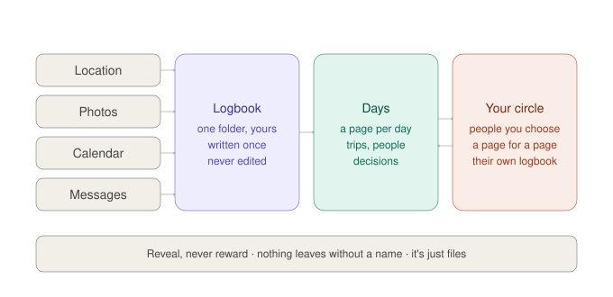

# Logbook

**A diary that writes itself.**

Your life already gets recorded — by your phone, your photos, your calendar, your messages. Logbook writes it all down once, in one folder that only you hold, and reads it back to you as days. You hand a page to someone you care about; they hand one back.

It is the opposite of social media: no feed, no followers, no likes, no counts. Reveal, never reward. Nothing leaves without a name.



## Sixty seconds

```bash
pipx install logbook            # or: pip install .
logbook init                    # creates ~/Logbook and your key
logbook add "had lunch with a friend by the lake"
logbook add ~/Downloads/takeout.zip     # any export, no flags
logbook show today
logbook verify                  # the chain is intact
```

That is the whole product. Everything else is a layer somebody plugs in.

## What is in the folder

```
~/Logbook/
  logbook/          the record. one file per month. append only. never edit.
    2026/09.jsonl
  inbox/            drop anything here. it gets read, then moved to done/.
  notes/            what you write. plain Markdown, one file per day.
  logbook.json      who this is, your timezone, the chain head.
```

Nothing here needs the app to make sense. Open the files in any editor twenty years from now.

If you also keep a clone of this repository, set `LOGBOOK_HOME` to your record's folder and pass that path to `logbook init`. On a case-insensitive disk (macOS by default) `~/Logbook` and a clone named `~/logbook` are the same folder; `init` refuses a folder that contains `pyproject.toml`, `.git` or `logbook/__init__.py`, and the CLI never picks such a folder as your record.

## Three rules

1. **Append only.** Every line is hash-chained to the one before. A broken chain is an error, never repaired silently.
2. **Files first.** No database is required to read, verify or export a logbook. Databases are caches.
3. **Nothing leaves.** Personal lines are encrypted with your key. There is no server. Sharing is a page handed to a named person.

## Read next

- [VISION.md](VISION.md) — why, and the rules the product refuses to break
- [LORE.md](LORE.md) — where the logbook comes from: ships, pilots, diaries, and the log in computing
- [SPEC.md](SPEC.md) — the format, one page; this is the part meant to become a standard
- [ARCHITECTURE.md](ARCHITECTURE.md) — the five layers and what each may depend on
- [ROADMAP.md](ROADMAP.md) — what ships when
- [CONTRIBUTING.md](CONTRIBUTING.md) — the easiest thing to build is an adapter for the export you have

## Status

v0.1 — the format, the CLI (init, add, show, verify, export) and the conformance fixture. Engines (days, trips, people) and the circle (sharing) are the next layers; see the roadmap.

Apache-2.0 for code. The specification is CC0.
