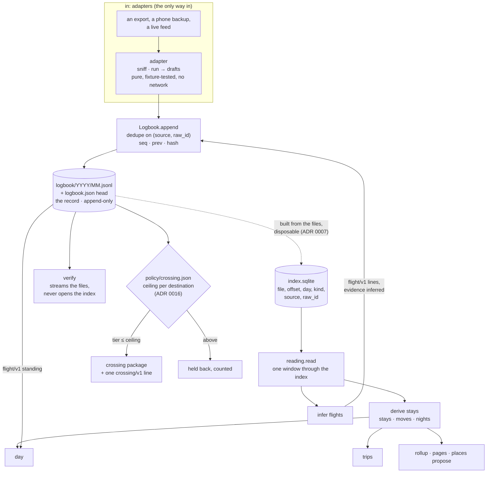

# How a line becomes a Day

A record is a folder of JSON lines. A Day is what `logbook day` prints from it. This page follows
one observation from the source that reported it to the row it ends up on: the files it lands in
and the chain that holds them, the tier it carries and the gate it has to pass to leave, the
adapters that write it and the readers that never do, the derivations that stack on top of each
other, what the second implementation proves about all of this, and why none of it needs the
record in memory. [ARCHITECTURE.md](ARCHITECTURE.md) gives the five layers; this page is the path
through them. Every example is synthetic: the Oslo persona of
[the demo walkthrough](try-it.md) does not exist, and that walkthrough runs every command named
here on a record `logbook demo` invents.



## The line, the files, the chain

Every observation is one JSON object on one line of `logbook/<YYYY>/<MM>.jsonl`, the month of its
`at` in UTC. The envelope is twelve fields, every one present in every line (SPEC §2). This is what
a note from the demo record looks like, with the digests shortened:

```json
{"id": "0199a2b0-7c1e-7d2a-9e4f-3b1c2d5e6f70", "seq": 4182,
 "at": "2026-06-17T17:00:00Z", "end": null, "tz": "Europe/Oslo",
 "source": "manual", "kind": "note", "tier": 2,
 "payload": {"schema": "note/v1", "text": "Anchored by nine. Grilled."},
 "recorded_at": "2026-06-17T19:04:11Z",
 "prev": "5c1d9e…b2a7", "hash": "8b1f2c…d904"}
```

The seven content fields (`at`, `end`, `tz`, `source`, `kind`, `tier`, `payload`) are canonicalised
by RFC 8785 and hashed; that digest, the previous line's hash, the position and the write time are
hashed again into the line's own hash:

```
content = canonical_json({at, end, tz, source, kind, tier, payload})
hash    = sha256( prev + "|" + seq + "|" + sha256(content) + "|" + recorded_at )
```

So each line names the one before it, back to the first line, whose `prev` is sixty-four zeros, and
`logbook.json` names the last. Change one character of any line, or drop one, and `verify` stops
at it. The chain is mandatory (ADR 0006) and invisible: `add` computes it, `verify` checks it, and
no other command mentions it. Chain order is `seq`, not file order, because a backfilled export
lands in old month files; `verify` takes every line from every file and orders by `seq` before it
checks a single link.

**Files are the truth** (ADR 0001). The private predecessor kept the log in a database and
mirrored it to files; a standard cannot require a server, so the files became the record and
anything else became a cache. **There is one log** (ADR 0003): no parallel event stream, no second
place a tool could record something. Anything that wants to write goes through an adapter or a
`manual` line, and the only code that writes to the month files is `Logbook.append`. The write
order is the crash story: the line is appended and fsynced, then `logbook.json` is written to a
temporary file and renamed into place, then the index is extended. A crash leaves the files ahead
of the head, never behind, so what the head names is on disk and anything past it is a complete,
chained tail.

Nothing is ever rewritten. A source that revises an observation appends a new line whose payload
`supersedes` the old one's id; a line that should be hidden gets a `retraction/v1` line pointing
at it, and readers mark it rather than drop it. The one operation that touches `prev` and `hash`
is a format migration, and it writes the fact of the migration into the chain as a line of its own
(SPEC §3.1).

**SQLite is only an index** (ADR 0007). `index.sqlite` holds, for every line, its `seq`, id,
instant, local day, kind, source, tier, `raw_id`, the file it is in and the byte offset it starts
at, plus the few fields readers filter on (`supersedes`, an entity ref, a media digest). A reader
asks the index where a day's lines are and then reads them back from the files; nothing but
counts is ever served from the index itself. It records the head, `seq` and timezone it was built
at, and any reader that finds it missing, unreadable or built at another head rebuilds it in one
streaming pass. `verify` never opens it. Deleting it loses nothing, which is the test of a cache.

## Tiers and the crossing gate

Every line carries a tier (SPEC §4): 1 for what a passer-by could see (location, photo metadata,
calendar, a flight), 2 for the owner's words and conversations (notes, messages, transcripts,
mail), 3 for money and health. Each payload profile names the tier its producers write by
default, and an import may raise a tier for a whole run but never lower one that a profile marks
MUST. Derived data inherits the highest tier of its evidence.

The tier matters at the one place lines leave the record: a crossing (RFC 0005), a package of
verbatim lines for a named member of the owner's circle. ADR 0016 makes the gate a setting in the
record, not a constant in the code:

- `policy/crossing.json` maps a destination to the highest tier that may cross to it:
  `{"hermes": {"max_tier": 2}}`. A destination the file does not name has no ceiling and cannot
  receive anything.
- Every export names its destination and the tiers it asks for: `logbook export crossing --to
  hermes --tier 1,2`. A request above the ceiling exits non-zero and names the file, so the owner
  raises the ceiling deliberately, in the record, or does not.
- Tier 1 crosses by default, tier 2 only when asked, tier 3 only when the policy allows it and the
  owner types `--tier 1,2,3`. A policy edit alone never lets tier 3 through.
- Every real export appends one `crossing/v1` line: the destination, the window, the counts per
  tier, the policy in force and the digest of the package. The record holds, under the hash chain,
  every time anything left it and under what ceiling. A dry run appends nothing.
- Beside the tier, a second gate (RFC 0034, [the signed day](signed-day.md)): only the lines of
  days the owner has signed cross, unless the export says `--unsigned`. Agents draft; the owner
  signs; only signed days cross.
- The resolution lines a package ships so a reader can name people are lines like any other: one
  above the requested tiers stays home and is counted as held back.

The price is stated in the ADR: a crossing line is tier 1 and crosses too, so a destination learns
when the record last crossed. That is data about the record, not about the owner's day, and it is
the point.

## Adapters and readers

Half of the code in this repository is adapters: some forty modules under `logbook/contrib/adapters/`,
one per source, each a mapping from one app's own store or export to the envelope. The reason is
plain. The envelope is small and fixed. The world is not: every phone app keeps its own SQLite
schema, every export has its own shape, and each of them changes under you. The spec stays the
size of an afternoon by pushing all of that variety into the one layer that is allowed to know
about it.

An adapter is three names: `NAME`, the `source` it writes; `sniff(path)`, a cheap answer to "is
this file mine?"; and `run(input_path, since)`, an iterator of drafts, which are lines minus the
chain fields. The rules are the same for all of them:

- **Pure.** No network on the default path; never a write to the source; fixture-tested on
  synthetic data only.
- **Stable identity.** Every draft carries a `payload.raw_id`, and `append` skips a draft whose
  `(source, raw_id)` is already in the record. Re-adding an export appends nothing. Where a source
  has both an export and a live API, one function maps both (ADR 0017), so a backfilled line and
  the same line pulled live are one line.
- **Everything that is cheap, classified, not filtered** (ADR 0011). Ingest is not the place for
  taste. Mail is one header line per message with a `class`; photos are one line per asset with a
  `provenance` and a face count. What is shown or hidden is a later pass that can be re-run.
- **Tolerant of drift.** An adapter that reads an app's SQLite confirms the columns it needs with
  `PRAGMA table_info` first; a column it does not need may be missing or renamed and the rows
  still read, and a table it needs that is gone is a counted skip or one clear error, never a
  traceback.

A reader is the other kind of code (ADR 0013). It takes the record at one head and computes
something from it: stays, nights, a trip, a Day, a rollup, a person's page. It never appends. The
same record gives the same output, and when the rules improve, the next run gives a better one and
no line has changed. That is what "derived is disposable" means in practice: a bad threshold is a
bad printout, not a bad line. Human input goes the other way: when the captain names a place,
confirms who was there or names a trip, that is a `note/v1` line written through `logbook add`, in
the captain's words, and the next reading reads it.

Between the two sits inference. `infer flights` and `infer keepers` read the record like a reader
and then append like an adapter, with a `source` of their own (`flight-inference`,
`keeper-inference`) and a `raw_id` built from the evidence, so a re-run appends nothing. An
inference is written down because it is an observation about the world, a flight the owner was
on, with evidence a later reader can weigh against a tracker's or the owner's own word. A trip is
not written down because it is a judgement about the record, a threshold applied to nights (ADR
0019). The line between the two is ADR 0013 rule 7: raw and derived never share a line.

## How the readers compose

The readers are one stack, each built on the one below, and they agree because they share it.

**One reading.** `reading.read(lb, first, last)` loads a window of local days through the index,
from the first day's local midnight to the end of the night after the last day, so the last night
is inside it. It loads the record's settings (`policy/stays.json`), its named places
(`places.json`) and its assets (`assets.json`), derives the stays of every subject, finds the night
of each day, resolves the record's refs to names and works out which identities are the owner's.
Every reader below takes a `Reading` and computes; none of them loads lines of its own.

**Derive stays.** The first reader turns `location/v1` points into stays, stops and moves. Points
of one subject are clustered in time order against an anchor, the cluster's first point or a
named place's centre, within a radius. A tracker that falls silent while the owner is still does
not break a stay: a silence whose next point is back inside the radius is time at the place. A
cluster is a stay when it lasts long enough or when anything is attached to it, an event, a note,
a photo whose instant falls inside; evidence promotes, duration is the fallback. A move spans the
gap between two clusters, with its distance along the points and a mode from the speed, or
`flight` when a silence starts near one airport and ends near another. When the owner's
positions match an asset's own track, the stay is `aboard` that asset, and the same grammar runs
on the asset's track inside it. The night of a day is the longest stay in the night window, and
it decides home or away.

**Infer flights.** A calendar entry whose title names a flight (`Flight to Zürich (XY 561)`) plus a
silence of twenty minutes or more in the points that starts within 8 km of one airport and ends
within 8 km of another is a flight: the gap's edges are the actual times, the entry's span the
scheduled ones. The result is a `flight/v1` line with evidence `inferred`. The same flight may
already be in the record as `tracked` (a flight tracker's export, a boarding pass) or `declared`
(the owner's sentence); `flights.merge` folds every observation into one line that stands,
tracked over inferred over declared, each new line superseding the last and listing all the
evidence. Readers never look at the drafts; they take `flights.standing`, the merged set, one line
per flight.

**Trips.** A trip is a run of consecutive days whose night is outside every place of kind `home`,
or in transit. It carries a route (the night places in order), its nights, the named places
visited, the people confirmed present, and the flights in and out from the standing set. Its id is
`trip:<first day>:<last day>`, reproducible from the record, so a note can refer to it and still
attach after a recompute. Nothing is appended; the captain's name for the trip is a note.

**The Day.** `logbook day` is one reading of the day and the day before (the night before is that
day's night). Its rows are the owner's stays and moves clipped to 00:00 to 24:00 local, with the
flights of the day from the standing set as rows of their own. To each row it attaches the day's
lines that fall inside its span, events, transcripts, notes, mail, calls, keepers by name,
messages and photos by count, and the people there, split into confirmed and proposed. What falls
inside no row is listed as unplaced rather than guessed at. The health line comes from the
`health-sample/v1` lines standing; the sources line shows every source's newest line, so a tracker
that fell silent at two in the afternoon is seen to have. [The Day](day.md) has the full grammar
and two synthetic days.

Because `day`, `trips`, `rollup nights` and the asset page all call the same `stays.derive` and the
same `flights.standing`, the longest trip in a rollup is the trip `trips` prints, and the night
`day` names is the night `trips` counted.

## What the second implementation proves

SPEC §6 says two independent implementations must agree before v1.0 is frozen. There are now two:
this one, in Python, and [logbook-ts](https://github.com/bighydro/logbook-ts), in TypeScript,
written from the spec. Both reproduce the head in `conformance/expected.json` on the sample record,
and CI runs a `cross-impl` job on every pull request that builds logbook-ts at its `main`, checks
its `verify` on the sample, then appends one note to a copy with the Python CLI and verifies the
copy with the TypeScript CLI. The two must agree on a record the other wrote.

What that proves is narrower and more useful than "it works". It proves the format is specified,
not described: a second person, with no access to the Python code, produced the same sixty-four
hex characters, which means every byte of the canonical form, the pre-image and the digest is
pinned by the text. Getting there is why canonicalisation is RFC 8785 exactly and not Python's
`json.dumps` (ADR 0014; the old rule is `logbook/0.1`, and a record under it is migrated, never
verified). It also proves the chain survives a writer it did not come from, which is the point of
a chain. And it found what the spec had left to the implementation: the order of a day, where a
retraction is listed, when an alias walk names nothing. Those became SPEC §3.2, *Readers*, so that
two implementations print the same day, not only compute the same head.

## The performance story

The record is never in memory. Two decisions carry that.

**Verify streams.** `Logbook.lines()` opens every month file at once, parses one line from each,
and keeps those in a heap keyed by `seq`; the smallest is yielded and its file read on. Memory is
one line per month file however long the record. On a synthetic record of three million lines
over 120 month files:

| | before | after |
|---|---|---|
| `verify` | 72 s, 4.7 GB peak RSS | 54 s, 23 MB |
| `export` of the whole log | 26 s, 6.5 GB | 23 s, 29 MB |

The writer keeps every file in `seq` order and the merge relies on it; a file that is not (which
the spec allows, since it orders by `seq` wherever a line is found) raises `UnsortedFile`, and
`verify` reads again through the two-pass sorted read that migration uses, sixteen bytes a line.

**Readers go through the index.** `show`, `day`, `export --day`, `retract` and the dedupe in
`add` ask `index.sqlite` where the lines they need are, by local day, by `(source, raw_id)` or by
kind and instant, and read only those lines back from the files. A Day on a record of millions of
lines reads in the time that day's lines take; the files are never swept. Dedupe is one `SELECT`
per batch of ten thousand drafts against the `(source, raw_id)` index, with the index extended at
every checkpoint so nothing is ever appended past it: one hundred thousand drafts already present
in a three-million-line record are skipped in two to three seconds at 41 MB.

Two slow tests (`LOGBOOK_SLOW=1`) build the three-million-line record in a temporary folder and
assert that `verify`'s peak memory on it is within 48 MB of a one-million-line record's and that
the dedupe stays under 256 MB, each measured in a process of its own. A third test fails if `show`
or `export --day` ever lists or scans a month file. The demo walkthrough ends with
`logbook demo --days 365`, a year of about 150,000 lines, which is enough to feel what the index is
for.

## What this page leaves out

The five layers and their contracts are in [ARCHITECTURE.md](ARCHITECTURE.md); the format is
[SPEC.md](SPEC.md); each decision above is an ADR under [Decisions](adr/README.md), and the payload
profiles are RFCs. The circle, how two records exchange pages, has a bundle format and no
transport yet, and that is deliberate: the bundle is defined first so that the first two
implementations can exchange pages by any means, including a USB stick.
