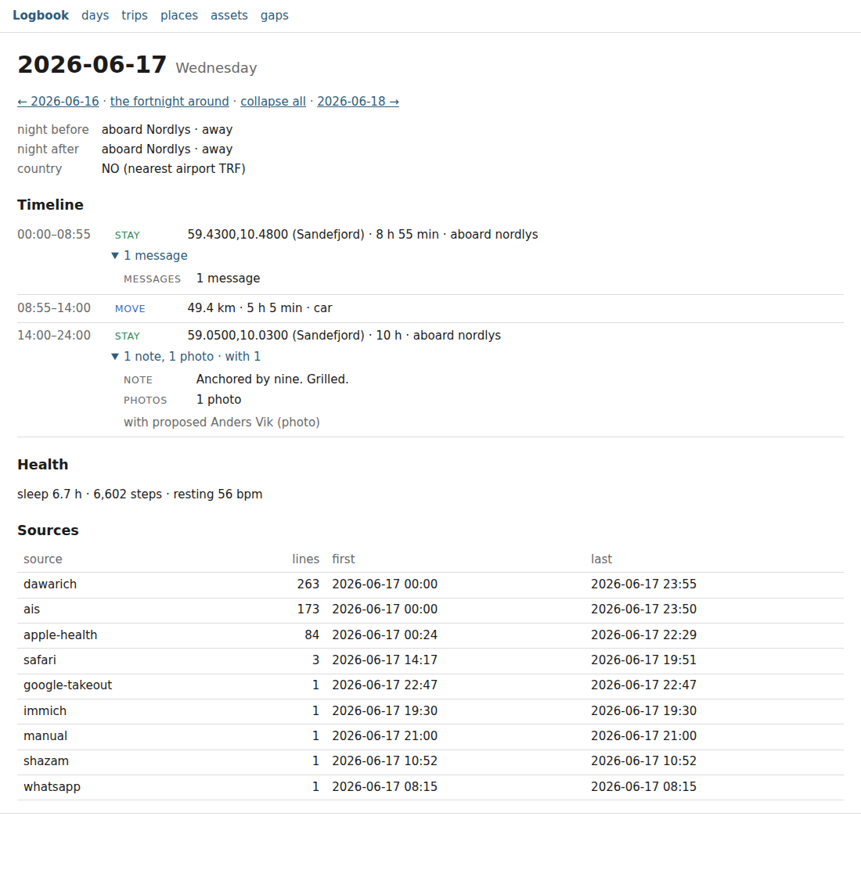

# The record in a browser

`logbook serve` reads the record in a browser, on this machine only.

```bash
logbook serve                 # http://127.0.0.1:8765/
logbook serve --port 8080
```

It is a reader (ADR 0013) with another output: the pages are the commands' own readers rendered as
HTML instead of text, built from the index and nothing else, and nothing is written. Open the
address it prints, read, close it. There is no login because there is no one to log in: the server
answers this machine and no other.



*The demo record (`logbook demo --days 30 --seed 1 --out ~/Demo`), Wednesday 17 June: a week
aboard the yacht Nordlys. Nothing in it is real.*

## The pages

| Page | What it is | The command it renders |
|---|---|---|
| `/day/YYYY-MM-DD` | the Day as a timeline: the nights either side, the country, the all-day entries; one row per stay, stop, move, flight or run aboard an asset, in time order, with the clock, the kind and what it was; each row's attachments (events, transcripts, notes, mail threads, calls, keepers named; messages and photos counted) and company (confirmed, then proposed) under a toggle; what is unplaced; the health line; the sources and when each last spoke | `logbook day` |
| `/days?from=&to=` | one row per day of the window, the day a link to its Day: the night, the kilometres moved, the flights, the stays and what attached, the people confirmed, the health triple, the usual sources with no line that day. Without a window, the record's last fortnight; a form and *earlier* / *later* links move it | `logbook days` |
| `/trips?year=` | the trips of the year: first and last day (a link to those days), nights, route, flights in and out, places, people. Without a year, the record's last; every year the record covers is a link | `logbook trips --year` |
| `/places` | the named places of `places.json`: position, radius, kind, tags, country | `logbook places list` |
| `/assets` | the registered assets and the last fix of each: the time, the position, the nearest named place, the speed, how long ago | `logbook assets status` |
| `/gaps?since=` | where each source went quiet: lines, first and last line, the longest silence, the days with no line folded into runs | `logbook sources --gaps` |

`/` is the front page: how many lines the record holds and the days it covers, and a link to each page.
`/day/YYYY-MM-DD?open=1` is the Day with every toggle open, for printing or saving whole; the page's
*expand all* link is that.

Every row reads as the command prints it, because it is the same code: the grammar of a stay, a
move or a night is `logbook/core/day.py`'s and `logbook/core/days.py`'s, a trip's is `logbook/core/trips.py`'s, a
silence's is `logbook/contrib/gaps.py`'s. A number here points at the lines it came from as it does under
`--json`: hover an attachment and its line ids are the tooltip.

## Three rules

Each is enforced in `logbook/contrib/serve.py` and tested in `tests/test_serve.py`.

**This machine only.** The server binds `127.0.0.1` and refuses any other host before a socket is
opened: `--host 0.0.0.0`, `::`, a LAN address, even `localhost` (a name, and a name may resolve to
anything) exit 2 naming the one host it takes. It never resolves a name, not even its own. To read
the record from another machine, read it there: copy the folder, or use an SSH tunnel to this one
(`ssh -L 8765:127.0.0.1:8765 host`), which is that machine's choice, not the server's.

**One document, nothing fetched.** A page is one HTML document with one inline stylesheet. No
script, no font, no image, no stylesheet link, no frame; every link, form and tooltip points at the
server's own paths. The `Content-Security-Policy` header the server sends (`default-src 'none'`)
tells the browser the same, so a payload that carried markup could not make a page fetch from
elsewhere even if the escaping here were wrong (every value is escaped). The test renders every page
and checks each attribute that can hold a URL, the inline style and the headers.

**Read-only.** Every request is a GET answered from the record at its head through the readers, and
the readers never write, not even `policy/stays.json`. The test takes the head and every file before
and after serving every page and finds them the same. Nothing is cached in the server: a line
appended while it runs is in the next page.

## Performance

A Day is one `day.read`: one reading of the day and the day before through `index.sqlite`, the
health lines of the two days by an indexed column, nothing swept. On the demo record a Day answers in
tens of milliseconds, a month of `/days` in under half a second; on a record of millions of lines a
Day still renders in under a second, because the index locates the day's lines and only they are
read ([docs/day.md](day.md), *Performance*). `/days` reads the window in chunks of a month, as the
command does; a year is a dozen readings. The airports table is loaded once, when the server starts.

The server is the standard library's (`http.server`, one thread per request); it is meant for one
reader on one machine, not for a crowd.

## What it is not

Not an editor: the pages write nothing, and the captain's words — a note, a naming, a confirmation
— go through the CLI as lines in the record, which the next page reads. Not a web application: no
JavaScript, no framework, no build step, no state but the record. Not the circle (ADR 0009): a page
here is for the owner's eyes on the owner's machine; a shared page is a signed bundle, and that is
another layer.
